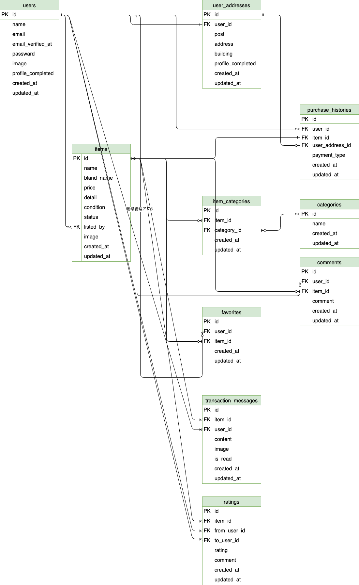

# coachtech フリマアプリ

## 環境構築

### Dockerビルド
1. 必要ディレクトリの作成
2. DockerDesktopアプリを立ち上げる
3. `docker-compose up -d --build`

### Laravel環境構築
1. `docker-compose exec php bash`
2. `composer install`
3. .envファイルを作成
    - `.env.example`をコピーして`.env`ファイルを作成
4. .envファイルに以下の環境変数を追加
- DB設定
    ```ini
        DB_CONNECTION=mysql
        DB_HOST=mysql
        DB_PORT=3306
        DB_DATABASE=laravel_db
        DB_USERNAME=laravel_user
        DB_PASSWORD=laravel_pass
- メール設定 (MailHog)
    ローカル環境でメールをテストするためにMailHogを使用します。
    ```ini
        MAIL_MAILER=smtp
        MAIL_HOST=mailhog
        MAIL_PORT=1025
        MAIL_USERNAME=null
        MAIL_PASSWORD=null
        MAIL_ENCRYPTION=null
        MAIL_FROM_ADDRESS="no-reply@example.com"
        MAIL_FROM_NAME="${APP_NAME}"

- 決済処理の設定 (stripe)
    Stripeは決済機能を提供するためのサービスです。開発環境でテスト決済を行うために以下を設定します。
    [Stripeのダッシュボード](https://dashboard.stripe.com/test/apikeys)にアクセスし、テスト用の公開可能キー（**Publishable key**）とシークレットキー（**Secret key**）を取得します。
    `.env`ファイルに以下の環境変数を追加し、取得したキーを貼り付けます。
    ```ini
        STRIPE_KEY=pk_test_****
        STRIPE_SECRET=sk_test_***

5. アプリケーションキーの作成
　　`php artisan key:generate`

6. データベースのセットアップ
    - マイグレーションの実行
        `php aritsan migrate`
    - シードの実行
        `php artisan db:seed`

7. MailHogの起動
　　`docker-compose up -d mailhog`

8. 画面での操作
ブラウザで `http://localhost` にアクセスしてください

## 使用技術（実行環境）

- **フレームワーク**: Laravel [8.6.12]
- **バックエンド**: PHP [8.3.23]
- **フロントエンド**: HTML, CSS, JavaScript
- **データベース**: MySQL [8.0.26]
- **認証**: Laravel Fortify , MailHog
- **決済処理**: stripe

## ER図


## URL
- 開発環境：http://localhost/
- phpMyAdmin：http://localhost:8080/
- MailHog: http://localhost:8025/

## 使い方
- **ユーザー登録**: `/register` で新しいアカウントを作成できます。
- **ログイン**: `/login` でログインできます。
- **デモアカウント**: 以下の情報でログインして機能を試すことができます。
  - **メールアドレス**: `test@example.com`
  - **パスワード**: `password`
  - **カード情報**: 
    開発環境で決済機能をテストするには、Stripeが提供する以下のテストカード情報を使用してください。

    | カード番号 | 有効期限 | CVC |
    | :--- | :--- | :--- |
    | `4242 4242 4242 4242` | 任意の将来の日付 | `123` |
